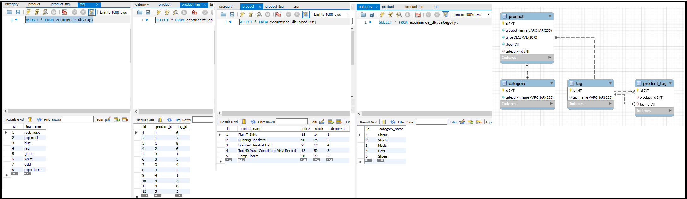
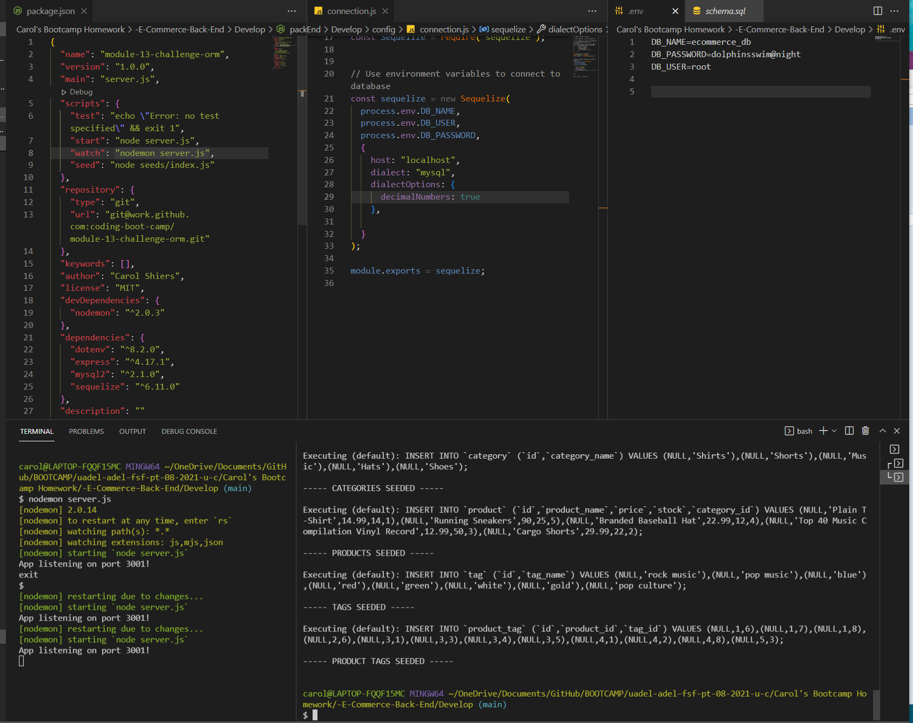

# Updated Portfolio Page-2
Live Application Link 👀  https://caz1502.github.io/-E-Commerce-Back-End/

---
## The Task
```md
Build the back end for an e-commerce site by modifying starter code. Configure a working Express.js API to use Sequelize to interact with a MySQL database.
```
---
## User Story
```md
AS A manager at an internet retail company
I WANT a back end for my e-commerce website that uses the latest technologies
SO THAT my company can compete with other e-commerce companies
```

---
## Acceptance Criteria 
```md
GIVEN a functional Express.js API
WHEN I add my database name, MySQL username, and MySQL password to an environment variable file
THEN I am able to connect to a database using Sequelize
WHEN I enter schema and seed commands
THEN a development database is created and is seeded with test data
WHEN I enter the command to invoke the application
THEN my server is started and the Sequelize models are synced to the MySQL database
WHEN I open API GET routes in Insomnia Core for categories, products, or tags
THEN the data for each of these routes is displayed in a formatted JSON
WHEN I test API POST, PUT, and DELETE routes in Insomnia Core
THEN I am able to successfully create, update, and delete data in my database
```
---
## Description
```
Back End Application to GET,CREATE, AMEND and DELETE via API requests
```
---
## Media
Application in Action ... [Youtube video](https://www.youtube.com/watch?v=zxgrWckxfS0)



---
## Apps 

*  Insomnia
*  mySQLWorkbench
*  Visual Studio Code
*  Node JS
*  NPM packages
   *  dotenv
   *  express
   *  mysql2
   *  sequelize  
*  Windows 10 photo editor
*  SnagIt

---
## Languages
* JavaScript
* SQL
---
## Resources 
* Teaching Crew at UniSA Coding Bootcamp 
* W3Schools 
* GitHub 
* Youtube
* Google
* StackOverflow
---
## License
  Licensed under [MIT](https://opensource.org/licenses/MIT/)

---